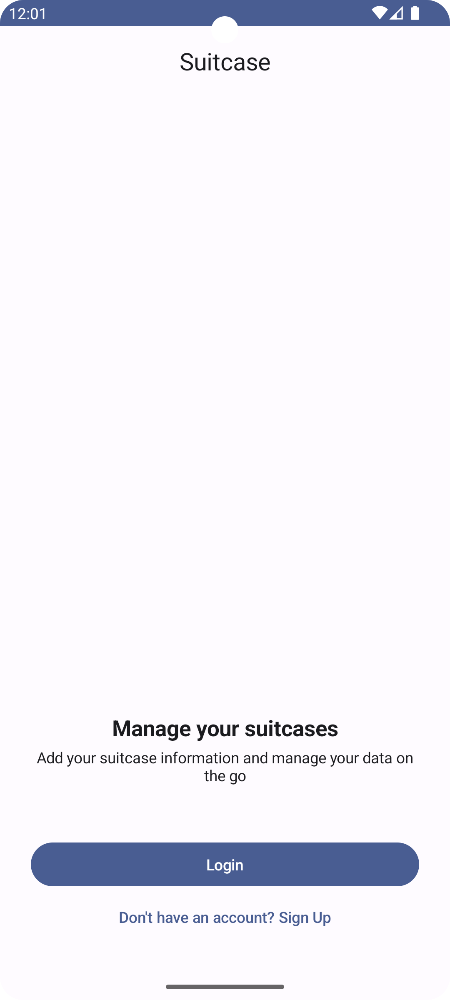
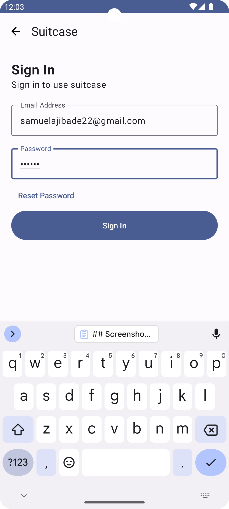
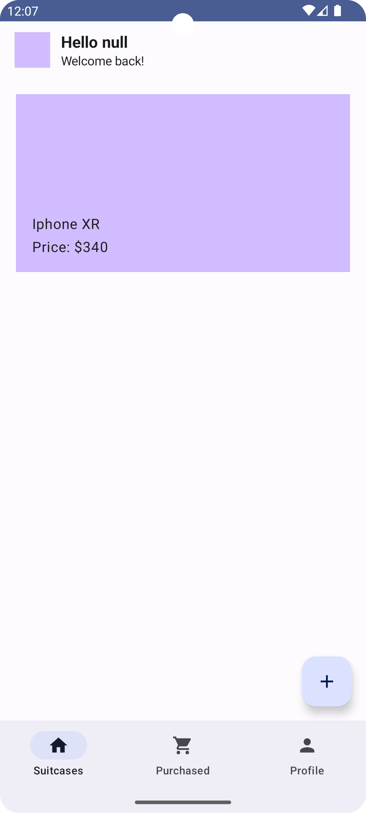

# Suitcase App

Suitcase is an experimental record app, built with [Jetpack][compose]. The goal of this app to
create
the UI in Compose and handle authentication and database logic with [Firebase][]

This app makes use of

* Jetpack Compose
* Dagger hilt
* Firebase

## Screenshots

    
    
    

### App Scaffolding

Package [`com.application.suitcase`][1]

[`JetnewsApp.kt`][2] arranges the different screens in the `Navbar`.

[`SuitcaseNavGraph.kt`][3] configures the navigation routes and actions in the app.

[1]: app/src/main/java/com/application/suitcase

[2]: app/src/main/java/com/application/suitcase/SuitcaseApp.kt

[3]: app/src/main/java/com/application/suitcase/SuitcaseNavGraph.kt

### Data

The data in the sample is static, held in the `com.application.suitcase.model` package.

[compose]: https://developer.android.com/jetpack/compose

[Firebase]: https://firebase.google.com